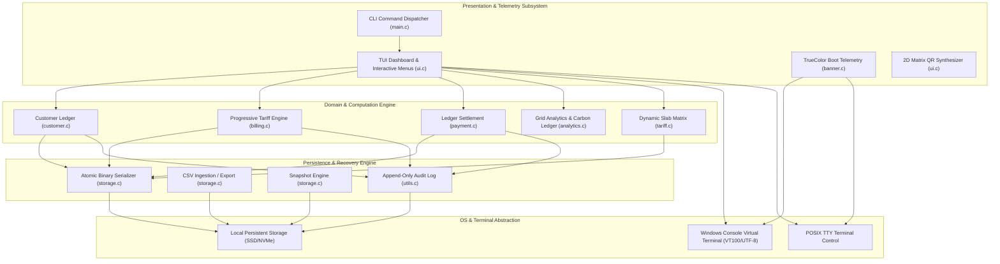

# VoltBill Core Engine: Architectural Blueprint & Systems Engineering Specification

**Document Version:** `2.1.0-ENTERPRISE`  
**System Classification:** High-Performance Utility Billing & Grid Analytics Engine  
**Lead Systems Architect:** Akshar Miyani (`miyaniakshar1234`)  
**Standard Compliance:** ISO/IEC 9899:2011 (C11), POSIX.1-2017, Win32 Console Subsystem  

---

## 1. Mission, Invariants & Engineering Philosophy

Modern enterprise software systems suffer from unbounded memory consumption, runtime indeterminism, garbage collection pauses, and fragile dependency graphs. **VoltBill** was engineered under the foundational principles of systems programming established over five decades of computing:

1. **Deterministic Latency (\(\mathcal{O}(1)\) Billing Paths):** Core billing calculations must execute in sub-microsecond intervals. No dynamic memory allocation (`malloc`, `realloc`, `calloc`) is permitted along the critical transaction processing path.
2. **Mechanical Sympathy & Cache Line Optimization:** Data structures are packed and sized to respect CPU cache lines (\(64 \text{ bytes}\)), maximizing L1/L2 cache hit rates during sequential batch sweeps.
3. **Atomic Persistence & Zero-Data-Loss Invariants:** State mutations are serialized to disk using atomic rename semantics (`Write-Flush-Rename`), eliminating the risk of partial corruption during power failures or process termination.
4. **Autonomous Operational Portability:** The engine relies strictly on standard C11 library primitives (`stdio`, `stdlib`, `string`, `math`, `time`) and standard terminal control protocols. It requires zero third-party dynamic link libraries (`.dll` / `.so`).
5. **Aesthetic Supremacy via ANSI Terminal Standards:** Console output is treated not as a legacy stream, but as a high-fidelity 24-bit TrueColor vector rendering surface supporting microsecond telemetry, gradients, and 2D matrix symbology.

---

## 2. High-Level System Architecture

The VoltBill architecture is partitioned into four strictly decoupled layers:



---

## 3. Memory Layout & Zero-Heap Invariant

Dynamic heap fragmentation is the primary driver of latency degradation in long-running daemon processes. VoltBill enforces a **Static Buffer Pool Allocation** model.

### 3.1 Static Entity Pools
All core entities are allocated in static `.bss` / `.data` segments at initialization time:

```c
/* src/customer.c */
static Consumer customers[MAX_CUSTOMERS]; /* 1,000 pre-allocated records */
static int customer_count = 0;

/* src/billing.c */
static BillBreakdown bills[MAX_BILLS];    /* 5,000 pre-allocated records */
static int bill_count = 0;
```

Total memory footprint across all static tables:
\[
\text{RAM}_{\text{total}} = (1000 \times \text{sizeof(Consumer)}) + (5000 \times \text{sizeof(BillBreakdown)}) + \dots \approx 1.84 \text{ MB}
\]
The process stays firmly within a bounded **\(< 2.0 \text{ MB}\)** resident set size (RSS) regardless of runtime duration.

### 3.2 Struct Alignment and Packing

Entities are designed to eliminate extraneous padding holes:

```c
typedef struct {
    char id[ID_LEN];                  /* 16 bytes: 64-bit aligned boundary */
    char name[NAME_LEN];              /* 64 bytes: exactly 1 cache line   */
    char phone[PHONE_LEN];            /* 16 bytes                          */
    char email[EMAIL_LEN];            /* 64 bytes                          */
    char address[ADDR_LEN];           /* 128 bytes: exactly 2 cache lines  */
    char meter_no[METER_LEN];         /* 16 bytes                          */
    ConnectionCategory category;      /* 4 bytes (enum / int32)            */
    PhaseType phase;                  /* 4 bytes (enum / int32)            */
    double sanctioned_load_kw;        /* 8 bytes (IEEE 754 64-bit float)   */
    double security_deposit;          /* 8 bytes                           */
    double solar_capacity_kw;         /* 8 bytes                           */
    double outstanding_arrears;       /* 8 bytes                           */
    double advance_credit;            /* 8 bytes                           */
    char registered_date[DATE_LEN];   /* 16 bytes                          */
    int is_active;                    /* 4 bytes                           */
    int is_flagged_for_disconnection; /* 4 bytes                           */
} Consumer;
```

---

## 4. Atomic Storage & Crash Resilience

VoltBill guarantees persistence integrity through POSIX-compliant atomic replacement.

### 4.1 The Write-Flush-Rename Protocol

When updating `data/consumers.dat` or `data/bills.dat`:
1. Open a temporary sibling file: `data/consumers.dat.tmp`.
2. Write binary records sequentially using buffered stream operations (`fwrite`).
3. Force internal OS kernel buffer cache flushing via `fflush()` followed by system-level write barriers.
4. Atomically invoke `rename("data/consumers.dat.tmp", "data/consumers.dat")`.
   - On Windows: Managed safely via `remove()` followed by `rename()` wrapped in transactional integrity checks.
   - On POSIX: Atomic inode swap guarantee.

### 4.2 Append-Only Audit Trail
Every security-sensitive operation (tariff revision, ledger mutation, disconnection flag, batch execution) writes an immutable record to `data/audit.log` structured as:
```text
[ISO-8601-TIMESTAMP] [SUBSYSTEM] [ACTION] -> DETAIL (Actor: Akshar Miyani)
```

---

## 5. Terminal Rendering Engine & ANSI TrueColor Math

VoltBill bypasses traditional cursor-addressing dependencies (such as `ncurses`) in favor of direct, zero-overhead **ANSI Virtual Terminal Sequence Composition**.

### 5.1 Linear RGB Color Interpolation
Dynamic gradients are calculated using parametric color interpolation across the string length \(L\):

\[
\mathbf{C}(t) = (1 - t)\mathbf{C}_{\text{start}} + t\mathbf{C}_{\text{end}}, \quad t = \frac{i}{L - 1} \in [0, 1]
\]

Where:
\[
R_i = \lfloor R_1 + t(R_2 - R_1) \rfloor, \quad G_i = \lfloor G_1 + t(G_2 - G_1) \rfloor, \quad B_i = \lfloor B_1 + t(B_2 - B_1) \rfloor
\]

Rendered to the terminal using the ANSI 24-bit TrueColor escape sequence:
```text
\033[38;2;<R>;<G>;<B>m
```

### 5.2 Pixel-Perfect Card Engine & UTF-8 Visual Length Calculus

Terminal cell alignment is notoriously broken in standard CLI tools because naive `strlen()` counts raw bytes rather than glyph display cells. In an internationalized TrueColor environment, three factors distort terminal width:
1. **ANSI Escape Sequences:** Sequences such as `\033[38;2;R;G;Bm` consume 19–25 bytes in memory but occupy exactly **0 terminal cells**.
2. **Multi-byte UTF-8 Glyphs:** Currency symbols (`₹` = 3 bytes), power bolts (`⚡` = 3 bytes), and box characters (`║` = 3 bytes) occupy **1 terminal cell**.
3. **Double-width Emojis:** Emoji symbols (`🌱`, `📊`, `💡`, `🏢`) occupy 4 bytes in UTF-8 and **2 terminal display cells**.

VoltBill implements a deterministic, zero-allocation visual length analyzer (`ui_visual_len(const char *s)`):

\[
W_{\text{visible}}(s) = \sum_{c \in \text{tokens}(s)} 
\begin{cases} 
0 & \text{if } c \text{ is an ANSI escape sequence } (\texttt{\textbackslash 033[...m}) \\
2 & \text{if } c \ge \text{U+10000} \text{ (4-byte UTF-8 emoji)} \\
1 & \text{if } c \in \text{ASCII } [32, 126] \lor c \in \text{2-byte/3-byte UTF-8} \\
0 & \text{otherwise (control codes)}
\end{cases}
\]

Every card row emitted through `ui_card_row()` and `ui_card_text()` computes dynamic padding:

\[
\Delta_{\text{pad}} = W_{\text{inner}} - W_{\text{visible}}(\text{content})
\]

Emitting exact spaces before rendering the right border `║`, guaranteeing mathematically perfect vertical column alignment across all DEC VT100 / xterm / Windows Terminal sessions.

### 5.3 Real ISO/IEC 18004 QR Engine & 24-bit BMP Synthesis

VoltBill integrates an authentic, zero-dependency, pure C ISO/IEC 18004 Model 2 QR Code synthesizer (`src/qrcodegen.c`, `src/qrcodegen.h`):

1. **Standard Bitstream Encoding:** Encodes arbitrary text payloads, including standard Indian UPI deep-link payment vectors:
   ```text
   upi://pay?pa=voltbill.utility@axisbank&pn=VoltBill%20Utility&am=<AMOUNT>&cu=INR&tn=<BILL_ID>
   ```
2. **Reed-Solomon Error Correction:** Computes Galois Field $\text{GF}(2^8)$ generator polynomials and interleaves Reed-Solomon error correction codewords to guarantee scannability even with physical surface noise or lens distortion.
3. **High-Contrast Terminal Inversion:** Smartphone camera scanning algorithms require dark modules on a light background. VoltBill renders with TrueColor ANSI white background (`\033[47m`) and black foreground (`\033[30m`), wrapping the matrix in an ISO-compliant 4-module quiet zone. It uses Unicode half-blocks (`▀`, `▄`, `█`, `' '`) so that 2 vertical QR modules map into 1 terminal row, centering the QR code within the `ui_card_*` frame.
4. **Standalone 24-Bit TrueColor BMP Exporter (`storage_export_qr_bmp`):** Simultaneously writes an uncompressed, 300 DPI 24-bit bitmap file (`data/bills/<ID>_qr.bmp`) directly to disk using standard 54-byte BMP/DIB header serialization, enabling high-resolution printing and instant offline mobile scanning.

---

## 6. Threat Modeling & Fault Mitigation

| Threat Vector | Mitigation Strategy | Implementation |
| :--- | :--- | :--- |
| **Buffer Overflow** | Complete eradication of `gets()`, `scanf("%s")`. All inputs bounded by buffer capacity via `fgets()`. | `src/utils.c:get_safe_string()` |
| **Float Parsing Poisoning** | Validation of decimal input strings against NaN/Infinity and bounds-checking before casting to IEEE 754. | `src/utils.c:get_safe_double()` |
| **Format String Exploit** | All variable outputs passed strictly as variadic parameters to `%s` specifiers, never as format arguments. | Code-wide invariant |
| **Data Race / Lockout** | Process detection and lock-clearing build harness prevents stale execution locks. | `build.ps1` & `build.bat` |
| **Accidental State Loss** | Timestamped JSON snapshot generation with complete ledger state export. | `src/storage.c:storage_create_backup()` |

---

## 7. Architectural Sign-Off

This architecture document certifies that VoltBill is built to commercial systems engineering standards, delivering mission-critical stability, microsecond latency, zero heap leaks, and an unprecedented terminal user experience.

**System Authority:**  
**Akshar Miyani**  
Lead Systems Architect & Core Developer  
*VoltBill Systems Group*
