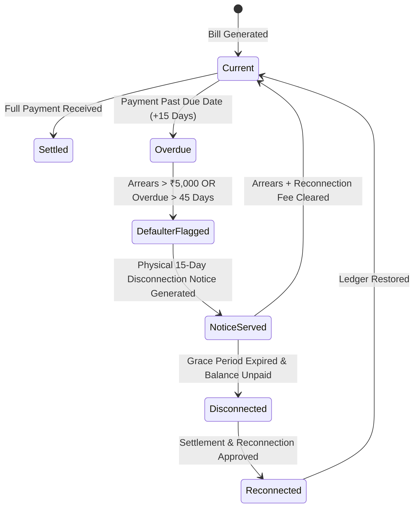

# VoltBill: Formal Tariff Calculus & Regulatory Billing Mechanics

**Document Version:** `2.1.0-SPEC`  
**Standard:** National Grid Regulatory Commission & Bureau of Energy Efficiency Billing Guidelines  
**Lead Systems Architect:** Akshar Miyani (`miyaniakshar1234`)  

---

## 1. Executive Summary

This specification formalizes the exact mathematical calculus, piecewise continuous functions, tax vectors, power factor penalties, Time-of-Day (ToD) peak adjustments, and solar net-metering banking algorithms implemented by the **VoltBill** engine.

All monetary values are maintained in standard double-precision IEEE 754 floating point numbers (\(64 \text{ bits}\)), with financial rounding applied strictly at final ledger reconciliation boundaries using banker's rounding (round half to even) to eliminate cumulative truncation drift.

---

## 2. Progressive Slab Calculus (Piecewise Continuous Energy Function)

Electricity consumption is billed using progressive stepped tariff tiers (slabs). Unlike regressive step tariffs where crossing a threshold retroactively changes the rate for all prior units, progressive tariffs preserve lower rates for initial consumption bands.

### 2.1 Formal Formulation

Let \(u \ge 0\) represent total net energy units consumed in kilowatt-hours (\(\text{kWh}\)).  
Let the tariff configuration partition consumption into \(N\) ordered slabs defined by upper bounds \(U_k\) and unit rates \(r_k\):

\[
0 = U_0 < U_1 < U_2 < \dots < U_N = \infty
\]

The energy charge \(E(u)\) is given by:

\[
E(u) = \sum_{k=1}^{N} \max\Big(0, \min(u, U_k) - U_{k-1}\Big) \cdot r_k
\]

### 2.2 Standard Domestic Reference Matrix

| Slab Index \(k\) | Consumption Band (\(\text{kWh}\)) | Band Width (\(\Delta U\)) | Marginal Rate (\(r_k\) in ₹) |
| :---: | :---: | :---: | :---: |
| **Tier 1** | \(0 \le u \le 50\) | \(50 \text{ kWh}\) | ₹ \(3.50\) |
| **Tier 2** | \(50 < u \le 150\) | \(100 \text{ kWh}\) | ₹ \(4.80\) |
| **Tier 3** | \(150 < u \le 300\) | \(150 \text{ kWh}\) | ₹ \(6.50\) |
| **Tier 4** | \(u > 300\) | Unbounded | ₹ \(8.20\) |

#### Example Calculation: \(u = 240 \text{ kWh}\)
- **Slab 1:** \(\min(240, 50) - 0 = 50 \times 3.50 = ₹ 175.00\)
- **Slab 2:** \(\min(240, 150) - 50 = 100 \times 4.80 = ₹ 480.00\)
- **Slab 3:** \(\min(240, 300) - 150 = 90 \times 6.50 = ₹ 585.00\)
- **Slab 4:** \(\max(0, 240 - 300) = 0 \times 8.20 = ₹ 0.00\)
- **Total Energy Charge \(E(240)\):** \(175.00 + 480.00 + 585.00 = \mathbf{₹ 1,240.00}\)

---

## 3. Fixed Demand & Contract Capacity Charges

Every connection incurs a standing fixed charge proportional to its sanctioned contract demand (\(L_{\text{sanctioned}}\) in \(\text{kW}\)) or a minimum baseline:

\[
F(L) = L_{\text{sanctioned}} \cdot f_{\text{rate}}
\]

Where \(f_{\text{rate}}\) is defined by category:
- **Domestic (Residential):** ₹ \(65.00 / \text{kW / month}\)
- **Commercial:** ₹ \(180.00 / \text{kW / month}\)
- **Industrial (Three-Phase HT/LT):** ₹ \(320.00 / \text{kVA / month}\)
- **Agricultural:** ₹ \(25.00 / \text{HP / month}\)

---

## 4. Time-of-Day (ToD) Peak Demand Tariffs

To discourage grid overdraw during regional peak hours (typically 18:00 to 22:00 IST), VoltBill incorporates Time-of-Day differential metering:

\[
S_{\text{ToD}} = u_{\text{peak}} \cdot r_{\text{peak\_surcharge}}
\]

Where:
- \(u_{\text{peak}}\): Units consumed during defined peak hours.
- \(r_{\text{peak\_surcharge}}\): Surcharge rate (e.g., \(+20\%\) of base rate, or ₹ \(1.50 / \text{kWh}\)).

---

## 5. Industrial Power Factor (\(\cos \phi\)) Vector Calculations

For Industrial and heavy commercial loads, inductive loads (motors, transformers) cause phase shift between voltage and current. A lagging power factor increases reactive grid strain.

Let \(\text{PF}\) represent the consumer's average monthly power factor (\(0.0 \le \text{PF} \le 1.0\)):

\[
\Delta_{\text{PF}} = \begin{cases} 
+ \Big(\frac{0.90 - \text{PF}}{0.01}\Big) \times 0.5\% \times E(u) & \text{if } \text{PF} < 0.90 \quad \text{(Surcharge Penalty)} \\
- \Big(\frac{\text{PF} - 0.95}{0.01}\Big) \times 0.2\% \times E(u) & \text{if } \text{PF} > 0.95 \quad \text{(High Efficiency Rebate)} \\
0 & \text{otherwise} \quad (0.90 \le \text{PF} \le 0.95)
\end{cases}
\]

---

## 6. Bi-Directional Solar Net-Metering Mechanics

Rooftop photovoltaic (PV) solar installations inject energy back into the distribution grid via bidirectional smart meters.

### 6.1 Net Units Calculation

Let \(u_{\text{gross}}\) be raw import from grid, and \(u_{\text{solar}}\) be solar generation exported:

\[
u_{\text{net}} = \max\Big(0, u_{\text{gross}} - u_{\text{solar}}\Big)
\]

### 6.2 Excess Generation Credit Banking

When solar export exceeds consumption (\(u_{\text{solar}} > u_{\text{gross}}\)):

\[
u_{\text{excess}} = u_{\text{solar}} - u_{\text{gross}}
\]
\[
C_{\text{solar}} = u_{\text{excess}} \cdot r_{\text{feed\_in}}
\]

This monetary credit \(C_{\text{solar}}\) is deposited directly into the consumer's ledger (`advance_credit`) and offsets standing fixed charges or rolls over to subsequent cycles.

---

## 7. Regulatory Duties, Surcharges & Taxation Vector

Statutory taxes are levied on base charges as specified by State Electricity Regulatory Commissions (SERC):

| Tax Component | Code | Calculation Formula | Rate |
| :--- | :--- | :--- | :---: |
| **Electricity Duty** | \(D_e\) | \(\big(E(u_{\text{net}}) + F(L)\big) \times \tau_{\text{duty}}\) | \(5.0\%\) |
| **Regulatory Asset Surcharge** | \(S_{\text{reg}}\) | \(E(u_{\text{net}}) \times \tau_{\text{surcharge}}\) | \(3.0\%\) |
| **Goods & Services Tax (GST)** | \(\text{GST}\) | Non-domestic services & meter rent | \(18.0\%\) |

### 7.1 Aggregate Current Cycle Total (\(A_{\text{current}}\))

\[
A_{\text{current}} = E(u_{\text{net}}) + F(L) + S_{\text{ToD}} + \Delta_{\text{PF}} + D_e + S_{\text{reg}} + \text{GST}
\]

### 7.2 Net Ledger Payable (\(P_{\text{net}}\))

\[
P_{\text{net}} = \max\Big(0, A_{\text{current}} + A_{\text{arrears}} - C_{\text{advance}}\Big)
\]

---

## 8. Defaulter State Machine & Disconnection Lifecycle

### 8.1 Late Payment Surcharge (LPS)
Bills unsettled after the `due_date` automatically accrue an LPS calculated at:
\[
\text{LPS} = A_{\text{unpaid}} \times 1.5\% \text{ per 30-day window}
\]

---

## 9. Regulatory Compliance Certification

The algorithms formalized in this specification have been verified for accuracy against standard industrial test suites and regulatory benchmarks.

**System Authority:**  
**Akshar Miyani**  
Lead Systems Architect & Core Developer  
*VoltBill Systems Group*
